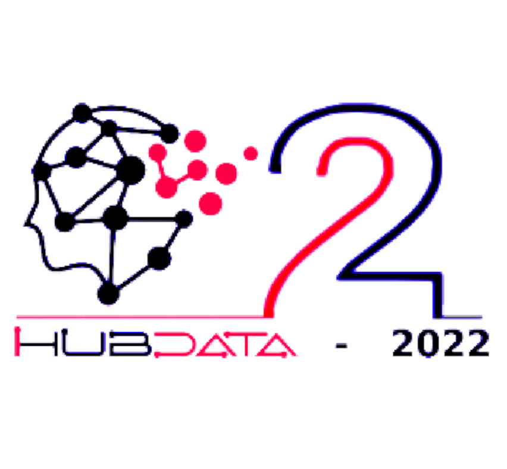
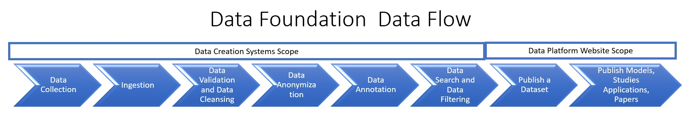
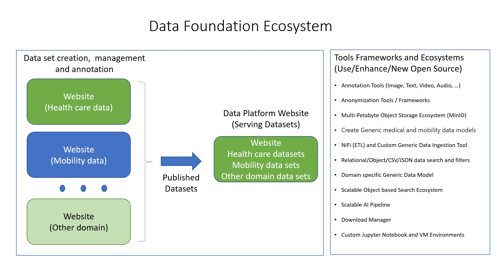
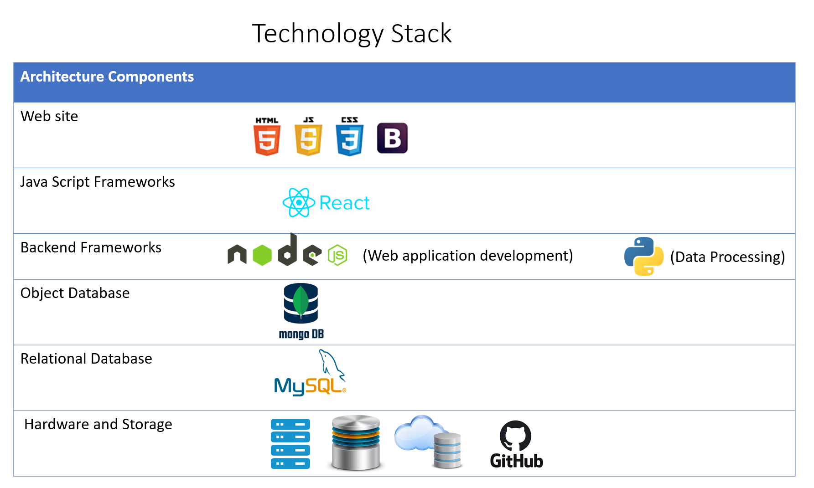
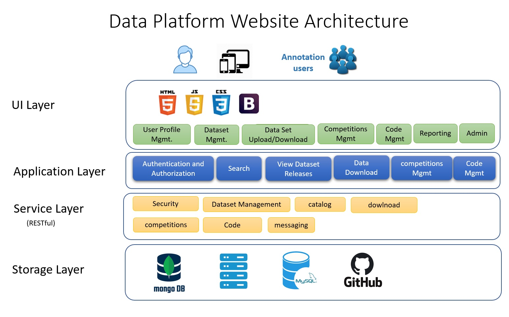
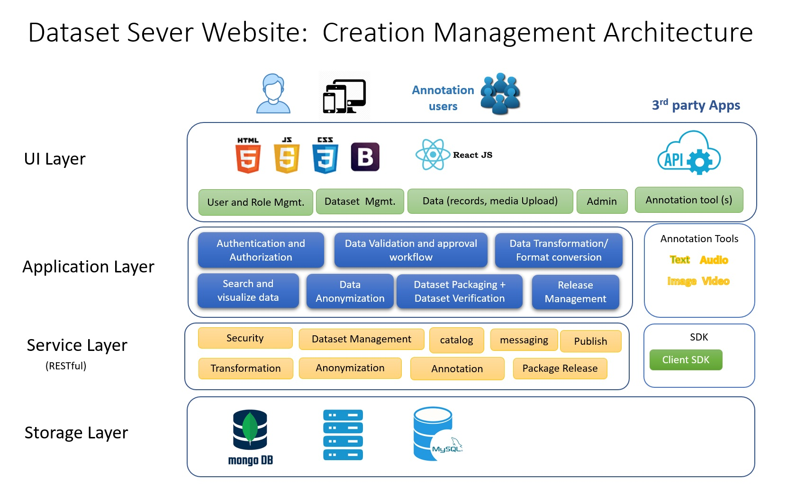

# Data Foundation Ecosystem
## Gundimeda Venugopal and Vikram Pudi
## IHUB-DATA, IIIT Hyderabad

 

## Introduction

-  
The Data Foundation Systems goal is to enable researchers to create, annotate, anonymize, publish and use datasets to build AI models, data visualations and analytics reports and manage dataset/model versions for heathcare, mobility, smart cities, energy and other domains in the Indian context.

-  
 To achieve this objective, Data Foundation Servers, Petabyte Object Storage and GPU powered AI model building/execution infrastructure are setup.

-  
 Building tools and frameworks to enable researchers publish and effectively use datasets is another key objective. Generic Data ingestion, Data query/extraction, Data Annotation (Image, Medical images, Video, Image Text, Text and Audio) and Data nononymization tools are planed taking few open source tools/ideas as a base and enhance these tools to fullfill the Data Foundation needs.

-  
 Docker and JupyterHub notebook based cutomized re- source allocation ecosystem planned to efficiently use system resouces (GPU, CPU, Memory, disk space and object storage).

## System Building Approach

 Innovative models for system building are evolved as recruiting developers from the Industry is a challenge.

-  
  A Hands-on Semester Course: “Data Foundation Systems” (Spring 2022) 144 students registered. 40+ project Multiple proof of concepts related to Data Foundation completed.

-  
  Data Foundation Summer Internship program (with IIITH and Srishti 2022 External students) 20+ students contributed to Data Foundation Core System Development, Integration and Testing A Data Foundation Core Ecosystem has been made available for IIITH Researchers to use.

-  
 A Learner – Contributor Model to engage IIITH students to support Data Foundation Projects has been created. Learners: Learners can learn at their own pace to contribute to Data Foundation technology POCs. Students who complete relevant POCs would get Data Foundation Certificates. Contributors: Contribute to Data Foundation System components and they Data Foundation developers. A Stipend would be paid and theywould conform to effort and timelines. Key Learners/Contributors would get recommendation letters.

-  
 Hiring external interns for Data Foundation projects.

## Data Foundation Data Flow

 A researcher’s journey to publishing a new dataset starts with Data Collection process followed by Data Validation, Data cleans ing, Data anonymization, Data annotation and data filtering before it is publcihed as a Dataset. Once the dataset is published, Researchers can use the dataset to build and publish AI models, Research Studies, Research papers and applications.

## Data Foundation Ecosystem

 The Data Foundation Ecosystem is split into three broad sub-systems: a) A Dataset Platform Website (which delivers datasets). This ecosystem would be built and managed by iHUB Data Foundation Team. b) Multiple Dataset Server Website(s) (that support Dataset Creation Manangement, Annotation, anonymization and publishing) Data owners/publishers would build and own these platform(s)/web site(s). c) Data Foundation Tools / Frameworks (that would use/Enhance/build New Open Source tools and frameworks to support common tasks) and shared Infrastructure/Ecosystens Tools and Frameworks Examples: Data Ingestion tool, Annotation and Anonymization Tools

## Data Foundation Website

Web site ( http://datafoundation-dev.iiit.ac.in/ ) features:
- User Profile Management and Authentication
- My Datasets (User specific work list items)
- Publishing of Dataset and its versions
- Dataset Listing, Download and Dataset details
- Private Dataset access workflow (publisher approval)
- Dataset Upload, Verification and Approval workflow
- Domain and Dataset specific Data Usage Agreement
- Publishing of Dataset AI Models/studies and Versions
- MinIO Storage and GPU Compute Ecosystem

## Technology Stack

Web Site: HTML5, CSS3, ReactJS, JS, Bootstrap
- Backend frameworks: NodeJS (web services), Python (data processing).
- Storage: MinIO Object Storage (Local S3 style storage), File and Block storage.
- Databases: MySQL, MongoDB
- Source Code: GitHub 

## Data Foundation Website

  Data Foundation web site enables researchers to Register, Publish datasets through an approval process (upload, dataset validation and approve) and it supports dataset catalog lmanagement, version management, downloads and usage tracking. The Ecosystem supports both public and private datasets. Researchers can create AI models and their versions using these datasets.

## Data Foundation Data Server(s)

  Data owners/publishers build data server platform(s)/web site(s) using the Data foundation provided/own/other tools/ frameworks to support raw data ingestion, curation, anonymization, annotation, search/filtering, datasets creation and their version management. The created datasets would be published through Data Foundation web site. Also, they may offer API based search services for fine grained data access for extrenal researchers.

## Hardware Ecosystem

- Web servers: Two web servers for Data Foundation, One web server each for Mobility and Healthcare.
- Shared Storage Ecosystem: 840 TB (Available) + 840 TB (ordered) Object Storage.
- Shared GPU Compute Ecosystem: 20 GPU Nodes (each contaiining 4 NVIDIA GeForce 3080 Ti GPU).

  
<footer>

Copyright © IHUB-Data, IIIT Hyderabad

Contact information: Data Foundation, IHUB-DATA, IIIT Hyderabad – Phone: +91-40–66531787 –Email: dfarchitect@ihub-data.iiit.ac.in; Web: 
<a href="http://datafoundation.iiit.ac.in/" title="Data Foundation" target="_blank">Data Foundation</a>

</footer>

